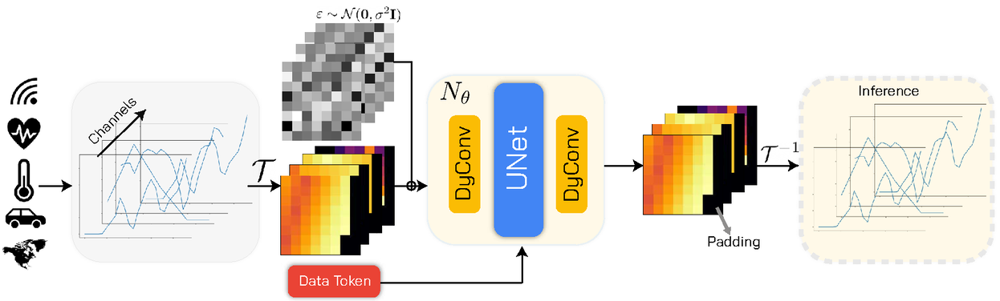

# News
(September 2025) We are happy to announce that the paper has been accepted to **NeurIPS2025**!

# 🧪 ImagenFew: Unified Time Series Generation Under Data Scarcity



## 📄 [Read the Paper](https://arxiv.org/abs/2505.20446)

This repository accompanies the paper **"Time Series Generation Under Data Scarcity: A Unified Generative Modeling Approach"**, which introduces a unified diffusion-based framework for generating high-fidelity time series, especially in few-shot regimes. The model leverages pretraining on a diverse set of datasets, dynamic convolutions for adaptive channel handling, and dataset token conditioning for domain-aware generation.

---

## 💡 What You Get

- **Full pipeline to reproduce the paper**: Preprocessed datasets, pretrained checkpoints, and scripts for training, fine-tuning, and evaluating the unified diffusion model under data scarcity.  
- **Flexible framework for custom models**: Easily plug in your own architecture (e.g., Diffusion, GANs, VAEs), run it within the same environment, and benchmark it using standardized protocols and metrics.  
- **Modular data design**: Add new datasets with minimal effort—data loading, preprocessing, and integration are all streamlined for multi-domain support.  

---

## 🛠️ Installation

Clone the repository:

```bash
git clone git@github.com:azencot-group/ImagenFew.git
cd ImagenFew
```

### 📦 Environment Setup

Using Python virtualenv:
```bash
python -m venv .venv
source .venv/bin/activate  # or `./.venv/Scripts/activate` on Windows
pip install -r requirements.txt
```

Using Conda:
```bash
conda create --name ImagenFew python=3.10 pip
conda activate ImagenFew
pip install -r requirements.txt
```

---

## 📁 Datasets

Preprocessed datasets are available for both **pretraining** and **fine-tuning**:

➡️ Download from: https://drive.google.com/file/d/1EHO1EXBJYg1ohFKxmJjV548qKtbSkVhF/view?usp=drive_link

Unzip the contents into the empty `./data` directory.

### Pretraining datasets include:
Stocks, Energy, ETTh1, Exchange, MSL, SMAP, PSM, SMD, ECG5000, NonInvasiveFetalECGThorax1, and more.

### Fine-tuning/evaluation datasets:
MuJoCo, ETTm1/m2/h2, Sine, Weather, ILI, ECG200, AirQuality, Saugeen River Flow, etc.

---

## 💾 Pretrained Models

Checkpoints for our pre-trained models are available in the same Google Drive folder:
https://drive.google.com/file/d/16MMBjyKT6VH7YwCshp2I5RXx4FQhStiA/view?usp=drive_link

The attached ZIP archive contains four pre-trained ImagenFew models, each using the `./config/pretrain/pretrain.yaml` configuration file, with different pretraining sequence lengths.

---

## 🚀 Getting Started

### 📌 Configurations

Configuration files are available in the `./configs` folder for all datasets and tasks.

### Pretraining

```bash
python run.py --no_test_model --seq_len <sequence_length> --config <config_file>
# or
./scripts/run_pretrain.sh
```

### Fine-tuning

Percentage-based:
```bash
python run.py --subset_p <percent> --model_ckpt <ckpt_path> --config <config_file>
```

Count-based:
```bash
python run.py --subset_n <count> --model_ckpt <ckpt_path> --config <config_file>
```

Scripts for all datasets:
```bash
./scripts/run_finetune_percentage.sh
./scripts/run_finetune_count.sh
```

---

## 📊 Visualization

Use PCA, t-SNE and other visualizations:

```bash
python run_visualization.py --model_ckpt <ckpt_path> --config <config_file>
# or
./scripts/run_visualization.sh
```

---

## 🧩 Plug In Your Own Model

Want to use your own generative architecture? Just follow these steps:

1. Create a folder under `./models/` with your model name.
2. Implement `Handler` that extends `generativeHandler`:
   - `build_model()`: instantiate the model
   - `train_iter()`: define a single training iteration
   - `sample()`: generate samples for a given class label
3. Optional: Take advantage of our DDP support for distributed training.
4. In your configuration file, specify the handler path using the format: `handler: models.{model_folder}.{handler_file}`

---

## 🔬 Citation

If you use this work, please cite:

```
@article{gonen2025time,
  title={Time Series Generation Under Data Scarcity: A Unified Generative Modeling Approach},
  author={Gonen, Tal and Pemper, Itai and Naiman, Ilan and Berman, Nimrod and Azencot, Omri},
  journal={arXiv preprint arXiv:2505.20446},
  year={2025}
}
```
